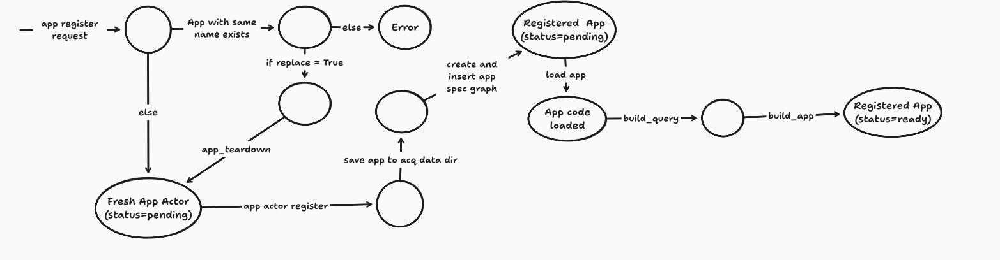

# Apps

An app is a piece of Python that reads plant data, computes something, and
emits a result. Soft sensors, anomaly detectors, and alerting rules are all
apps.

Apps are the second half of Acquirium. Drivers push data *in* (see
[drivers.md](drivers.md)); apps read it back *out* and derive new values from
it. The two halves are configured differently, and mixing them up is the most
common early mistake:

| | Drivers | Apps |
|---|---|---|
| Job | pull data from a source into the server | compute derived values from stored data |
| Defined by | subclassing `Driver` | subclassing `App` |
| Deployed by | a `[[drivers]]` block in `acquirium.toml` | `aq.register_app(...)` in Python |

There is no CLI command and no config section for apps. You deploy one by
running a Python script that calls the client.

## The App class

An app is a subclass of `App` with some metadata, a query, and a `run` method:

```python
from acquirium import Acquirium, App, AppContext, Output

class TankLevelMonitor(App):
    name = "tank_level_monitor"      # unique id; how you run and stop it later
    version = "0.1"
    app_type = "soft_sensor"
    outputs = [{"kind": "trigger", "point_uri": "urn:derived:tank_level"}]

    def build_query(self, aq: Acquirium):
        ...                           # what data do I need?

    def build_app(self, ctx: AppContext):
        ...                           # optional: run once, before the first run

    def run(self, ctx: AppContext) -> list[Output]:
        ...                           # runs every interval; returns outputs
```

`build_query` and `run` are required. `build_app` is optional and returns
`None` by default.

The three methods map onto the app's lifecycle:

| Phase | Method | When | Gets |
|---|---|---|---|
| Query | `build_query` | at registration | the `Acquirium` client |
| Build | `build_app` | once, before the first run | `ctx.params` from `register_app` |
| Run | `run` | every `interval` | `ctx.params` from `run_app`, `ctx.state` |

### Ask for data by meaning

`build_query` describes the data the app needs in terms of *what it is*, not
where it is stored. You do not name columns or point URIs — you name classes,
quantity kinds, and media, and the server resolves them against the ontology
that drivers inserted with the data.

```python
def build_query(self, aq: Acquirium):
    return (aq.find_entity(_class="reverse osmosis membrane", alias="ro")
              .find_related(_class="ConnectionPoint", alias="RO_cp", hops=1)
              .find_data(_from="RO_cp", alias="ro-tds")
              .filter_by_quantity_kind("flow mass")
              .filter_by_substance("constituent salt"))
```

Each `alias` names a result you read back later. The chain reads: find the RO
membrane, walk one hop to its connection point, take the data on that point,
and keep only the salt mass-flow.

The building blocks:

| Method | Does |
|---|---|
| `find_entity(_class=, alias=, uri=)` | start from an equipment class |
| `find_related(_class=, alias=, hops=, _from=)` | walk the graph |
| `find_data(alias=, _from=)` | take the data attached to a node |
| `filter_by_quantity_kind(...)` | keep points measuring this quantity |
| `filter_by_medium(...)` | keep points on this medium (water, brine, ...) |
| `filter_by_substance(...)` | keep points about this constituent |
| `filter_by_unit(...)` | keep points in this unit |

Every filter takes `exclude=True` to invert it, so you can subtract streams you
don't want.

Return either a single `Query`, or a dict of named queries when the app needs
more than one set of data:

```python
return {"feed": ro_feed_q, "permeate": ro_perm_q}
```

A single query arrives as `ctx.query`. A dict arrives as `ctx.queries["feed"]`
and so on. This is the only difference between the two forms.

Because the query is built from meaning, the same app runs against any plant
whose graph uses the same vocabulary. Nothing in it is specific to one site.

### Read the data

Inside `run`, execute the query. Two ways:

```python
data = ctx.query.data(cast_value="float")     # DataObject, keyed by alias
latest = data.latest("ro-tds")["value"][0]    # newest row for one alias
unit = data.units()["ro-tds"]                 # the unit URI, or None
```

or straight to a Polars frame, which is easier when you want to do maths:

```python
df = ctx.queries["feed"].dataframe(
    limit=48, order="desc", shape="wide", cast_value="float"
)
```

`shape="wide"` gives one column per alias plus `time`. `order="desc"` with
`limit` fetches the *newest* N rows — sort afterwards if your maths needs
oldest-first. `start=` and `end=` take a fixed window instead.

### Emit results

`run` returns a list of `Output`. There are three kinds:

| Factory | Use for |
|---|---|
| `Output.timeseries(point_uri=, rows=)` | a derived value stored back as a stream |
| `Output.event(point_uri=, severity=, message=)` | something notable happened |
| `Output.trigger(url=, message=, point_uri=)` | POST to a webhook |

All three are keyword-only. `message` on a trigger is any JSON — a sentence, or
a structured dict a dashboard can unpack.

```python
return [Output.trigger(
    url="localhost:10001/alerts",
    message={"text": "membrane nominal", "status": "nominal"},
    point_uri=self.outputs[0]["point_uri"],
)]
```

Declare what an app emits in the class-level `outputs` list. Each entry needs
`kind` (`timeseries`, `event`, or `trigger`) and `point_uri`. Pass `point_uri`
on the `Output` too — it is dropped from the webhook payload if you omit it.

### Two kinds of params

Apps take configuration through `ctx.params`, and it is filled from two
different places depending on the phase:

```python
acq.register_app(MyApp(), params={"baseline_start": ..., "k_sigma": 4.0})
#                        ^ build-time: reaches build_app via ctx.params

acq.run_app("my_app", params={"run_window": 48})
#                     ^ run-time: reaches run via ctx.params
```

Config that belongs to the *model* — training windows, thresholds — goes on
`register_app`, so it lives with the registration and is used once at build.
Config that belongs to a *run* — window sizes, smoothing — goes on `run_app`.

Whatever `build_app` returns is handed to every subsequent `run` as
`ctx.state`. That is how a trained model gets from the build phase to the run
phase without retraining on every tick.

## Deploying

Start the server, with at least one driver feeding it data:

```bash
acquirium server --config acquirium.toml
```

Then register and run the app from Python:

```python
acq = Acquirium(server_url="localhost", server_port=8000)

acq.register_app(MyApp(), replace=True)
acq.run_app("my_app", keep_alive=True, interval=60)
```

`register_app` sends the app to the server and builds it. `replace=True`
tears down an existing app of the same name first; without it, re-registering
is an error. `run_app` with `keep_alive=True` runs `run` every `interval`
seconds until stopped; without it, it runs once.

Managing a deployed app:

```python
acq.list_app_runs()                      # all apps and their status
acq.list_app_runs(app_id="my_app")       # one app's build/run detail
acq.stop_app(app_id="my_app")            # stop its loops
acq.delete_app("my_app")                 # stop, unregister, remove source
```

### What happens on register

`register_app` reads the source file of your app's class and ships it to the
server, which stores it and re-imports it inside a Ray actor. Two consequences
worth knowing:

- **The app file must stand on its own.** It is loaded server-side by itself,
  so a class defined in a notebook cell, or one that imports sibling modules
  from your project, will not load.
- **Imports must be installed on the server**, not on your laptop. If your app
  uses numpy, the server needs numpy.

Registered apps are stored in the graph and restored when the server restarts.




## Worked example: the WaterTAP apps

`scripts/watertap/` holds four scripts that together make one working demo: a
membrane-fouling soft sensor and the dashboards it alerts. They are the
reference for everything above.

| File | What it is |
|---|---|
| `monitor.py` | the smallest possible app — one query, one webhook |
| `monitor_gui.py` | dashboard that receives `monitor.py`'s alerts (port 10000) |
| `ml-workload.py` | the real one: trains a model, detects fouling |
| `fouling_gui.py` | dashboard for `ml-workload.py` (port 10001) |

The apps and the dashboards are joined only by an HTTP POST. The dashboards
import nothing from Acquirium — they are plain stdlib HTTP servers, which is
the point: `Output.trigger` is just a webhook, so anything that accepts a POST
works.

### First, the data

The apps query by meaning, so the ontology has to be in the graph before they
can resolve anything. That is the driver's job.
`deployments/WATERTAP/scripts/acquirium.toml` has a parquet driver with:

```toml
source_id              = "watertap-seawater-ro-fouled"
watertap_graph_path    = "deployments/WATERTAP/models/seawater-ro-fouled/model.ttl"
watertap_insert_graph  = true
```

`watertap_insert_graph = true` is the load-bearing line. It inserts the
model's ontology so the stored points carry domain semantics — that they belong
to an RO membrane, that they measure mass flow, that they concern seawater.
Without it there is data but nothing to query *by*, and
`find_entity(_class="reverse osmosis membrane")` matches nothing.

See the [WaterTAP deployment readme](../deployments/WATERTAP/readme.md) to get
this running.

### `monitor.py` — the minimal app

43 lines, and it shows the whole shape. It finds the salt mass-flow at the RO
membrane's connection point, reads the latest value, and posts a sentence:

```python
def run(self, ctx: AppContext) -> list[Output]:
    data = ctx.query.data(cast_value="float")
    latest = data.latest("ro-tds")["value"][0]
    unit = data.units()["ro-tds"].rsplit('/', 1)[-1]
    message = {"text": f"Latest seawater salt level is {latest} {unit}"}
    return [Output.trigger(url="localhost:10000/alerts", message=message)]
```

`build_query` returns a bare `Query`, so it arrives as `ctx.query`. There is no
`build_app` and no state — every run is independent. There are no params
either; the URL is a literal.

Note `data.units()` returns a unit *URI*, hence the `rsplit` to get something
printable. Units come from the ontology, not from the app.

Deploy it:

```python
acq = Acquirium(server_url="localhost", server_port=8000)
acq.register_app(SeawaterTDSmonitor(), replace=True)
acq.run_app("seawater_tds_monitoring", keep_alive=True, interval=10)
```

In the checked-in file these two lines are commented out and only `stop_app` is
live — uncomment them to run it.

### `ml-workload.py` — build phase, params, and state

This is the notebook `notebooks/watertap/soft-sensor.ipynb` turned into a
long-running app, and it uses every feature above. The idea: train a linear
model on the plant's first two weeks (assumed clean), then keep scoring the
latest window. Relative permeability = actual permeate flow / predicted flow.
As the membrane fouls, actual falls below expected.

**Two named queries**, because it needs feed and permeate separately:

```python
return {"feed": ro_feed_q, "permeate": ro_perm_q}
```

The permeate query is a good look at filters doing real work — keep mass flow
rate on fluid water, then subtract what you don't want:

```python
.filter_by_quantity_kind("mass flow rate")
.filter_by_medium("fluid water")
.filter_by_medium("brine", exclude="True")
.filter_by_substance("constituent salt", exclude=True)
```

**`build_app` trains once**, on the window given at registration:

```python
def build_app(self, ctx: AppContext):
    baseline_start = ctx.params.get("baseline_start")
    baseline_end = ctx.params.get("baseline_end")
    k_sigma = ctx.params.get("k_sigma", 4.0)

    feed = ctx.queries["feed"].dataframe(start=baseline_start, end=baseline_end,
                                         shape="wide", cast_value="float")
    ...
    features = [i for i in feed.columns if i != "time"]
    target = [i for i in permeate.columns if i != "time"][0]
    model = InteractionOLS(features).fit(X, y)

    rel = y / model.predict(X)
    threshold = float(rel.mean()) - k_sigma * float(rel.std())

    return {"model": model, "features": features, "target": target,
            "baseline_mean": ..., "threshold": threshold}
```

The features are **discovered from the query results**, not hardcoded — the
ontology decides what the model's inputs are. The returned dict becomes
`ctx.state`.

Note the threshold is derived from the baseline's own noise: how far below 1.0
relative permeability wanders on clean data sets the line for what counts as
fouling.

**`run` scores the latest window** with per-run params:

```python
run_window = ctx.params.get("run_window", 48)
smooth = ctx.params.get("smooth", 6)
sustain = ctx.params.get("sustain", 4)

# Most recent run_window samples, oldest-first for the rolling mean.
feed = ctx.queries["feed"].dataframe(limit=run_window, order="desc",
                                     shape="wide", cast_value="float")
...
rel_raw = df[target].to_numpy() / model.predict(X)
rel = pl.Series(rel_raw).rolling_mean(window_size=smooth, min_samples=1).to_numpy()

below = rel < threshold
sustained = bool(len(below) >= sustain and below[-sustain:].all())
```

`order="desc"` + `limit` gets the newest rows; the later `.sort("time")`
restores oldest-first so the rolling mean is causal. One dip below the
threshold is `watch`; `sustain` consecutive dips is `fouling`. That is the
whole trick for not alerting on noise.

The trigger carries a structured message, which is what the dashboard unpacks:

```python
message = {"text": text, "status": status,
           "relative_permeability": round(latest_rel, 4),
           "baseline": ..., "threshold": ..., "drop_pct": ...,
           "as_of": latest_time.isoformat()}

return [Output.trigger(url="localhost:10001/alerts", message=message,
                       point_uri=self.outputs[0]["point_uri"])]
```

**Deploying it** shows both param channels:

```python
acq.register_app(
    MembraneFoulingSoftSensor(),
    replace=True,
    params={                                    # -> build_app
        "baseline_start": datetime(2025, 1, 1, tzinfo=timezone.utc),
        "baseline_end": datetime(2025, 1, 15, tzinfo=timezone.utc),
        "k_sigma": 4.0,
    },
)

acq.run_app(
    "membrane_fouling_soft_sensor",
    keep_alive=True, interval=60,
    params={"run_window": 48, "smooth": 6, "sustain": 4},   # -> run
)
```

Change the baseline or `k_sigma` and you must re-register — the model retrains.
Change `run_window` and you only re-run. As with `monitor.py`, these calls are
commented out in the checked-in file.

### The dashboards

`monitor_gui.py` and `fouling_gui.py` are stdlib HTTP servers that accept
`POST /alerts`, keep the alerts in memory, and serve an auto-polling page. Run
one, open the printed URL, and point an app's trigger at it:

```bash
python scripts/watertap/fouling_gui.py     # dashboard on :10001
python scripts/watertap/ml-workload.py     # register + run
```

`monitor_gui.py` expects only `message.text` and renders a feed.
`fouling_gui.py` expects the fouling app's fuller message and unpacks `status`,
`relative_permeability`, `baseline`, `threshold` and `drop_pct` into a numeric
readout with nominal / watch / fouling colours.

The pair makes the point about `Output.trigger`: because `message` is arbitrary
JSON, you choose how much structure to ship. A sentence gets you a log; a dict
gets you a UI.

### Putting it together

```bash
# 1. server + the fouled-RO driver (inserts the ontology, feeds the points)
acquirium server --config deployments/WATERTAP/scripts/acquirium.toml

# 2. the dashboard
python scripts/watertap/fouling_gui.py

# 3. the app (uncomment register_app / run_app first)
python scripts/watertap/ml-workload.py
```

Stop it with `acq.stop_app(app_id="membrane_fouling_soft_sensor")` — which is
exactly what the script does as checked in.
